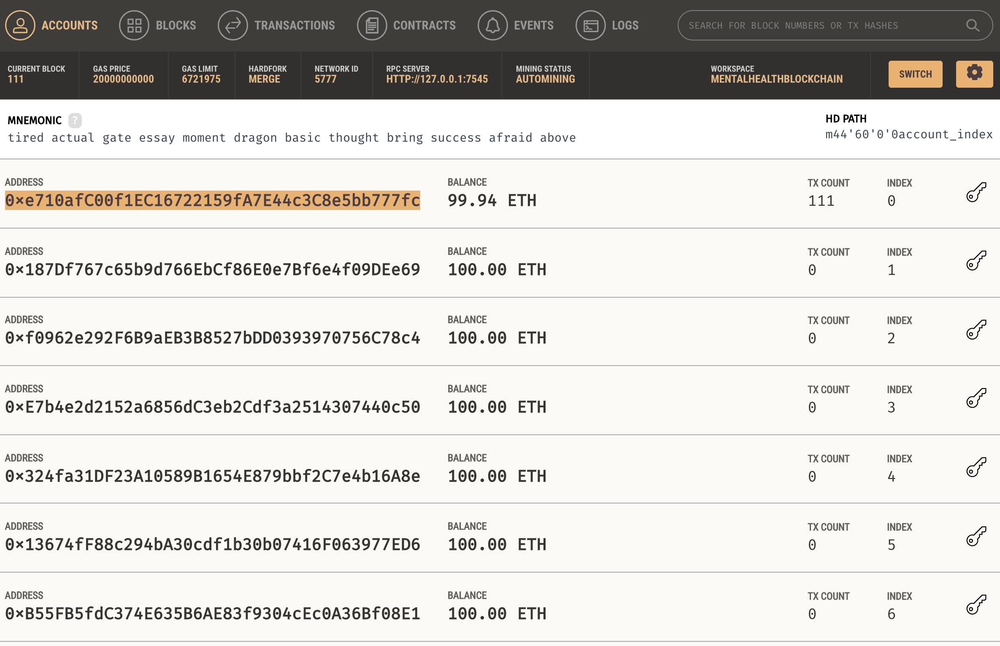
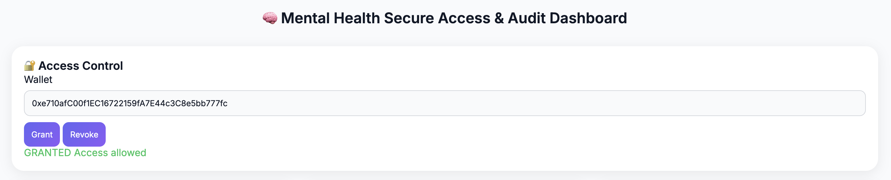
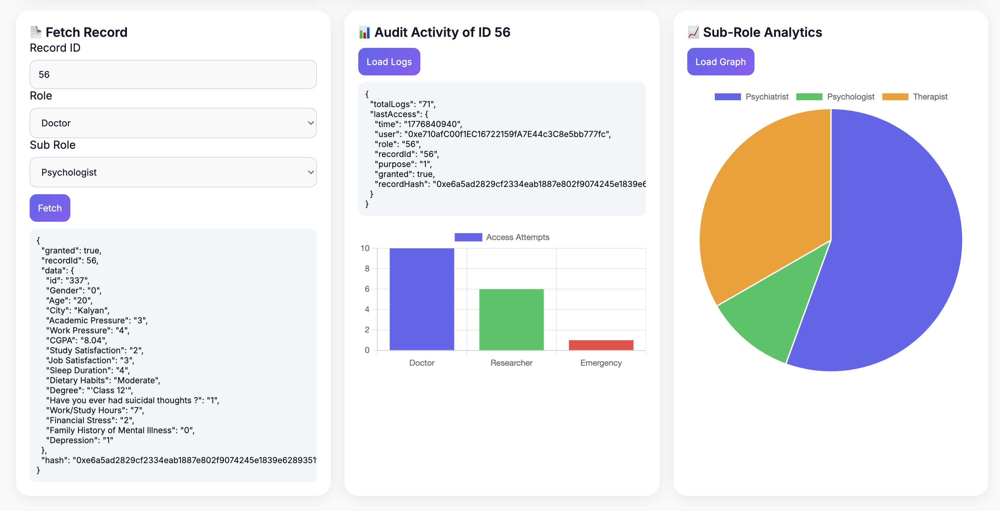
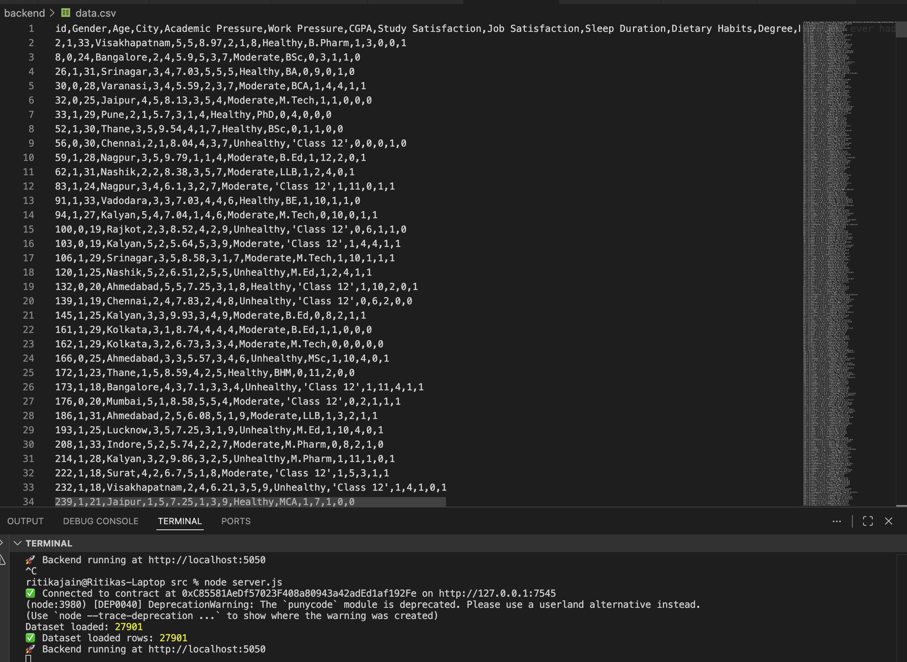

# 🧠 Mental Health Blockchain System

A secure and transparent system for managing mental health records using blockchain technology. This project focuses on ensuring **privacy, data integrity, and controlled access** to sensitive healthcare information.

---

## 🚀 Features

- 🔐 Secure storage of mental health records using blockchain  
- 👩‍⚕️ Role-based access control for authorized users  
- 📜 Transparent and immutable audit logs  
- ⚡ Smart contract-based permission handling  
- 🌐 Simple and interactive dashboard interface  

---

## 🛠️ Tech Stack

- Frontend: HTML, CSS, JavaScript  
- Backend: Node.js  
- Blockchain: Solidity  
- Tools: Ganache, MetaMask, Web3.js  

---

## 📂 Project Structure

---

## 📸 Screenshots

---

## ⚙️ Setup Instructions

### 1. Clone the repository

### 2. Install dependencies

### 3. Start blockchain (Ganache)
- Run Ganache locally  
- Connect MetaMask to the local network  

### 4. Deploy smart contracts

### 5. Run the application

---

## 🔒 How It Works

1. User requests access to a mental health record  
2. Smart contract verifies permissions  
3. Access is granted or denied securely  
4. Every activity is recorded as an immutable log  

---

## 🎯 Future Enhancements

- AI-powered mental health insights  
- Integration with hospital systems  
- Mobile-friendly interface  
- Advanced analytics dashboard  

---

## 👩‍💻 Author

Ritika Jain  

---

## 📜 License

This project is licensed under the MIT License.
